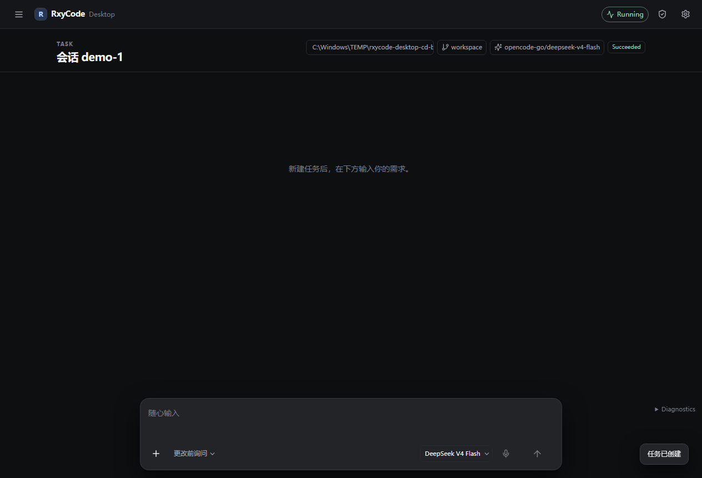
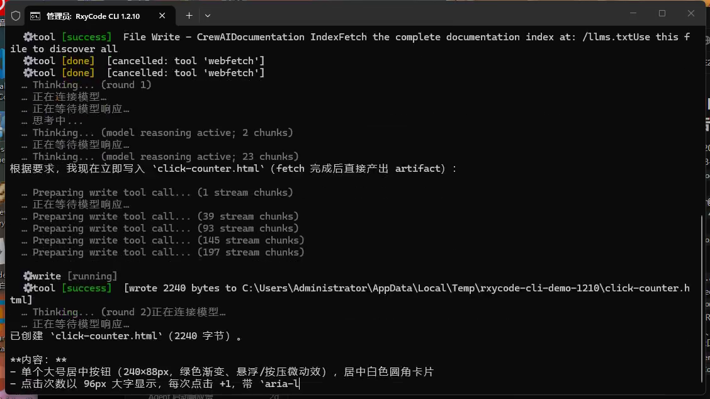

<!-- README_SYNC: source=working-tree; updated=2026-08-16 -->
<div align="center">

[English](./README.md) · **简体中文**

# RxyCode

**给开发者用的本地规划-执行型编程助手：默认 OpenTUI，也可开 Desktop GUI；每次工具调用都先过安全门。**

[⭐ 给仓库点 Star](https://github.com/xin-yi33/RxyCode) —— 方便以后回来，也让同样在找「会规划、会调工具、危险操作会问你」的本地 Agent 的人更容易发现它。

[](https://github.com/xin-yi33/RxyCode/releases/tag/v1.2.10)
[](https://www.python.org/)
[](LICENSE)
[](https://github.com/xin-yi33/RxyCode/actions/workflows/ci.yml)
[](https://github.com/xin-yi33/RxyCode/issues)
[](https://github.com/xin-yi33/RxyCode/stargazers)

</div>

<div align="center">
  
</div>

RxyCode 是一个 Python 编程 Agent。核心无界面：`Session`（`core/session.py`）包着 `AgentV2`。前端有三条路：**OpenTUI**（默认终端 UI）、**Desktop**（`rxycode gui`）、以及 **Ink** 回退。复杂任务走 LangGraph：规划 → 拆解 → 执行 → 验证 → 综合；简单问题走快速路径。隔离式子代理、MCP 和 30+ 工具都挂在按风险分级的安全门后面。

## 和线性 ReAct 循环差在哪

只列会改变用法、并且能指到代码的差异：

| 差异 | 实际效果 | 代码位置 |
|---|---|---|
| 先验证再报成功 | 验证器对照原始目标检查工具结果，不直接把「模型说完了」当成完成 | `validation/` |
| 规划-执行，而不是单轮工具循环 | 分层拆解、按依赖并行执行，再综合答案 | `planning/`、`execution/`、`synthesis/`、`core/graph.py` |
| 每次工具调用过安全门 | READ / WRITE / DANGER 分级、写入白名单、审批框、审计日志 | `core/safety/` |
| 两套真实界面 | OpenTUI 走 stdio JSON-RPC；Desktop 有计划 / 目标 / `+` 菜单 | `frontend/opentui-app/`、`frontend/desktop-app/`、`appserver/` |
| 隔离式子代理 | 独立会话、工具、权限和预算，不是把主 Agent 再调一遍 | `core/subagents/` |
| 无头核心 | `Session.prompt()` 自己不做 I/O；TUI / GUI 只订阅协议事件 | `core/session.py` |

## 快速开始

### 前置条件

| 要求 | 版本 | 说明 |
|------|------|------|
| Python | 3.10+ | 后端运行时 |
| Bun | 最新 | 一键安装在缺失时会自动装（OpenTUI） |
| Node.js | 20+ | Desktop GUI、Ink 回退（`RXYCODE_TUI=ink`） |
| OpenAI 兼容 API 密钥 | — | 你配置的任意提供商（OpenAI、DeepSeek、OpenCode Go 等） |

### 方式一：一键安装

**Windows PowerShell：**

```powershell
powershell -ExecutionPolicy Bypass -c "irm https://raw.githubusercontent.com/xin-yi33/RxyCode/v1.2.10/install.ps1 | iex"
rxycode
```

**macOS / Linux：**

```bash
curl -fsSL https://raw.githubusercontent.com/xin-yi33/RxyCode/v1.2.10/install.sh | sh
rxycode
```

安装脚本会在需要时引导安装 `uv`，创建隔离环境，并安装钉死的 **`v1.2.10`**。

**下载说明：** 只有最新版（**`v1.2.10`**）提供可安装的 wheel/sdist。更早的 GitHub Release 仍保留说明，但不提供安装包。

### 方式二：一次性运行

```bash
uvx --from "git+https://github.com/xin-yi33/RxyCode.git@v1.2.10" rxycode
```

### 方式三：永久安装

```bash
uv tool install --force "git+https://github.com/xin-yi33/RxyCode.git@v1.2.10"
rxycode
```

### 方式四：从源码安装

```bash
git clone https://github.com/xin-yi33/RxyCode.git
cd RxyCode
python -m pip install -e .
rxycode
```

### 方式五：Docker

```bash
cp .env.example .env   # 设置 OPENAI_API_KEY 和 RXYCODE_API_TOKEN
docker compose up -d api       # API 服务器（仅本地回环）
docker compose run --rm tui    # 交互式 TUI（需要 TTY）
```

### 首次启动

| 命令 | 打开什么 |
|------|----------|
| `rxycode` 或 `python -m RxyCode` | 默认 **OpenTUI**（Bun + `frontend/opentui-app/`） |
| `rxycode --version` | 打印包版本，不初始化运行时 |
| `rxycode gui` | **Desktop** Electron 应用（`frontend/desktop-app/`） |
| `rxycode --api` | 只起 API（`api_server.py`，HTTP + SSE） |
| `RXYCODE_TUI=ink rxycode` | Ink 回退 TUI |

1. 运行 `rxycode`。即使还没配模型，TUI 也会打开。
2. 若模型列表为空，OpenTUI 会提示并自动打开 `/addmodel`（凭据输入有掩码）。
3. 若 `~/.RxyCode/config.yaml` 里已有至少一个模型，则不再弹向导。
4. 直接用自然语言布置任务。Desktop 用 `rxycode gui`，在底部 Composer 输入。

## CLI 怎么工作

默认 CLI 就是 OpenTUI。它和核心之间是 **stdio JSON-RPC**：前端拉起 `python -m appserver`，后者托管 `Session` → `AgentV2`。你输入任务后，会看到流式 token、工具调用、必要时的审批，以及最终回答。

**本 README 录的演示任务：** 在仓库外的空目录里，让 RxyCode 写一个单文件 `click-counter.html`——大按钮、点击计数、布局干净一点。几分钟内应结束。画面里能看到输入任务、工具调用（`write` / `read`）、安全门若弹出则批准本次、磁盘上出现 HTML。

下面这段录像是真实跑这次任务：标题为 **RxyCode CLI 1.2.10** 的终端拉起 `python -m appserver`，用 ProtocolClient 发送任务，流式打出工具调用和进度，最后写出 `click-counter.html`。

<p align="center">
  <video controls width="800" poster="docs/images/cli-demo-cover.png" src="docs/assets/cli-demo.mp4">
    <a href="docs/assets/cli-demo.mp4">CLI 演示视频（mp4）</a>
  </video>
</p>

<p align="center">
  <a href="docs/assets/cli-demo.mp4"></a>
</p>

不用 TUI、同一套传输（脚本和 Desktop CLI harness 走这条路）：

```text
python -m appserver
        │  stdio JSON-RPC
        ▼
ProtocolClient  →  session/new  →  session/prompt
```

仓库里的 harness 是 `frontend/desktop-app/scripts/real-business-cli-harness.mts`，给测试/运维用，不是额外的用户命令。

## Desktop GUI

`rxycode gui` 启动 Electron 应用。任务区底部是 Composer。点 `+` 会打开：

| 菜单项 | 作用 |
|--------|------|
| 文件和文件夹 | 附加本地文件，路径写入 prompt |
| 在项目中使用 | 选择工作区并开新聊天 |
| 目标 | 打开目标对话框（Esc 或点遮罩关闭） |
| 计划模式 | 开关计划模式（Agent 只生成/改写计划文档） |

计划卡片提供 **是，实施此计划**、**补充说明** 和 **跳过**。权限档位文案是：更改前询问 / 自动编辑 / 完全访问。切到「完全访问」会二次确认（Esc 取消）。设置 → 更新与诊断里的「当前版本」是 **1.2.10**。

<p align="center">
  
</p>
<p align="center">
  
</p>
<p align="center">
  
</p>

## 架构

```
OpenTUI (frontend/opentui-app)     Desktop (frontend/desktop-app)
        │ stdio JSON-RPC                    │ stdio JSON-RPC
        └──────────────┬────────────────────┘
                       ▼
              python -m appserver
                       │
                       ▼
              Session (core/session.py)
                       │
                       ▼
              AgentV2 (core/agent_v2.py)
                 ├── 简单查询  →  快速路径 + 缓存
                 ├── 多任务    →  隔离式子代理
                 ├── 编排      →  规划 + 构建
                 └── 复杂任务  →  LangGraph：
                       目标规划器 → 拆解器 → 执行器
                            → 工具编排器 + core/safety
                            → 验证器 → 综合器

Ink 回退：RXYCODE_TUI=ink → api_server.py（HTTP + SSE）→ 同一个 Session
```

`Session` 与传输无关：只发协议事件，不画界面。`appserver` 把事件写成 stdout JSON-RPC。`api_server.py` 把同一批事件映射成 SSE，给 Ink 用。

## 工作模式

| 界面 | 怎么开 | 行为 |
|------|--------|------|
| 构建 | TUI `/build` 或 Desktop 默认 | 规划 → 拆解 → 执行 → 验证 → 综合 |
| 规划 | `/plan` 或 Desktop 计划模式 | 只读分析并产出计划文档；点实施之前不改文件 |
| 编排 | `/compose` | 规划 + 构建（更短的管道） |

## 配置

配置在 `~/.RxyCode/config.yaml`。请求始终打向你选定的 `base_url`，**不会**被静默改成别的厂商。

```yaml
cache:
  enabled: true
  prompt_prefix_cache: true   # 开启 Provider 侧 KV 缓存
  ttl: 3600

# 示例：OpenCode Go
models:
  opencode-go/deepseek-v4-flash:
    model_name: deepseek-v4-flash
    provider_id: opencode-go
    provider_name: OpenCode Go
    api_key_env: OPENCODE_GO_API_KEY   # 或 api_key_secret，放在仓库外
    base_url: https://opencode.ai/zen/go/v1
    max_tokens: 8192
    temperature: 0.7
```

OpenTUI 里用 `/addmodel` 走引导向导。不要把 API key 写进仓库、README 或截图。

## 安全边界

工具真正执行前，`core/safety/` 会分级：

- **READ** — 只读检查（`read`、`grep`、`glob`、`webfetch` 等）
- **WRITE** — 可逆副作用（`write`、`edit`、多数 `bash`）
- **DANGER** — 破坏性或安装类命令；bash 可按模式升级（`rm -rf /`、`git push --force` 等）

白名单外的写入会被拦住。TUI 和 Desktop 弹出审批框；审计日志在 `~/.RxyCode/logs/audit.jsonl`，敏感字段会打码。Desktop 默认权限是「更改前询问」。

## 常用命令与快捷键（OpenTUI）

| 命令 | 说明 |
|------|------|
| `/help` | 全部命令 |
| `/addmodel` | 添加模型（凭据掩码） |
| `/models` / `/model <name>` | 列出 / 切换模型 |
| `/build` `/plan` `/compose` | 工作模式 |
| `/clear` | 清除对话上下文 |
| `/memory add/list/search` | 记忆 |
| `/queue add/run` | 任务队列 |
| `/cache` | 缓存统计 |
| `/language` | 界面语言 |
| `/thinking` | 思考面板 |
| `/children` `/child` `/parent` | 隔离式子代理树（功能开启时） |

| 快捷键 | 作用 |
|--------|------|
| `Tab` | 切换工作模式 |
| `Ctrl+P` | 命令面板 |
| `Ctrl+T` | 开关思考内容 |
| `Esc` | 取消 |
| `Ctrl+C` | 复制 / 取消流式 / 清空输入；2 秒内连按两次退出 |

## 测试怎么跑

不要把徽章上的数字当成此刻的现场清点。已记录的基线在 [CHANGELOG.md](CHANGELOG.md)（例如 v1.2.8 的 10412、v1.2.9 的 10840）和 [docs/modules/tests.md](docs/modules/tests.md)。CI 见 [`.github/workflows/ci.yml`](https://github.com/xin-yi33/RxyCode/actions/workflows/ci.yml)。

```bash
# 前端
cd frontend && npm test
cd frontend/opentui-app && bun test

# 后端（确定性；不跑付费 live 模型）
python -m pytest tests -m "not live and not pty and not serial" -n 2 --dist loadscope -q
python -m pytest tests -m "serial and not live and not pty" -n 0 -q

# 安装器依赖的打包契约
python -m pytest tests/unit/test_packaging_contract.py tests/unit/test_installers.py -q
```

真实 provider 的 live 测试是 opt-in，没 key 会跳过。本仓库本机还跑过 GUI/CLI 真实业务套件 **T01–T08**；**T09 跳过**。

## 版本历史

| 版本 | 日期 | 要点 |
|------|------|------|
| [v1.2.10](https://github.com/xin-yi33/RxyCode/releases/tag/v1.2.10) | 2026-08 | Desktop 计划 / 目标 / `+` 菜单；计划卡片实施/补充/跳过；CLI `appserver` + ProtocolClient harness；本机 T01–T08 真实业务（T09 跳过） |
| [v1.2.9](https://github.com/xin-yi33/RxyCode/releases/tag/v1.2.9) | 2026-08 | 隔离式子代理（Phase C）：独立 Child 会话；`@agent`、Task 工具、`subtask=true`；OpenTUI 子代理树；上游复用审计；CHANGELOG 记录 10840 测试、eval 门 94.7% |
| [v1.2.8](https://github.com/xin-yi33/RxyCode/releases/tag/v1.2.8) | 2026-08 | 模型适配：DeepSeek v4、豆包（ark）、Anthropic Claude 5；能力精确隔离；CHANGELOG 记录 10412 测试 |
| [v1.2.7](https://github.com/xin-yi33/RxyCode/releases/tag/v1.2.7) | 2026-08 | 完成的回答不再被只读探测失败丢掉；搜索词更干净；豆包 provider |
| [v1.2.6](https://github.com/xin-yi33/RxyCode/releases/tag/v1.2.6) | 2026-08 | webfetch 解码、MCP 误路由、Windows shell/编码、搜索加固 |
| [v1.2.5](https://github.com/xin-yi33/RxyCode/releases/tag/v1.2.5) | 2026-08 | DeepSeek / 通义千问 / Claude 适配；延迟导入；显式路由；stdio 传输 |
| [v1.2.4](https://github.com/xin-yi33/RxyCode/releases/tag/v1.2.4) | 2026-08 | 添加模型体验；评测 harness；协议层与 TS 客户端 |
| [v1.2.3](https://github.com/xin-yi33/RxyCode/releases/tag/v1.2.3) | 2026-07 | 10 家预设、自动发现、批量添加 |
| [v1.2.2](https://github.com/xin-yi33/RxyCode/releases/tag/v1.2.2) | 2026-07 | 自动安装 Bun 与 OpenTUI 依赖；无模型时打开 `/addmodel` |
| [v1.2.1](https://github.com/xin-yi33/RxyCode/releases/tag/v1.2.1) | 2026-07 | 安装包内带上 OpenTUI 源码 |
| [v1.2.0](https://github.com/xin-yi33/RxyCode/releases/tag/v1.2.0) | 2026-07 | 默认 OpenTUI（Ink 回退） |
| [v1.1.0](https://github.com/xin-yi33/RxyCode/releases/tag/v1.1.0) | 2026-07 | Ink TUI、SSE、Docker、CI、一键安装 |
| [v1.0.0](https://github.com/xin-yi33/RxyCode/releases/tag/v1.0.0) | 2026-06 | LangGraph 重写：规划-执行、工具、分层记忆 |
| [v0.3.3](https://github.com/xin-yi33/RxyCode/releases/tag/v0.3.3) | 2025-12 | 初版：ReAct + 验证 + MCP |

完整记录见 [CHANGELOG.md](CHANGELOG.md)。

## License

[MIT](LICENSE) © RxyCode contributors

觉得有用就 [点个 Star](https://github.com/xin-yi33/RxyCode)，问题和改进直接开 [Issue](https://github.com/xin-yi33/RxyCode/issues)。
